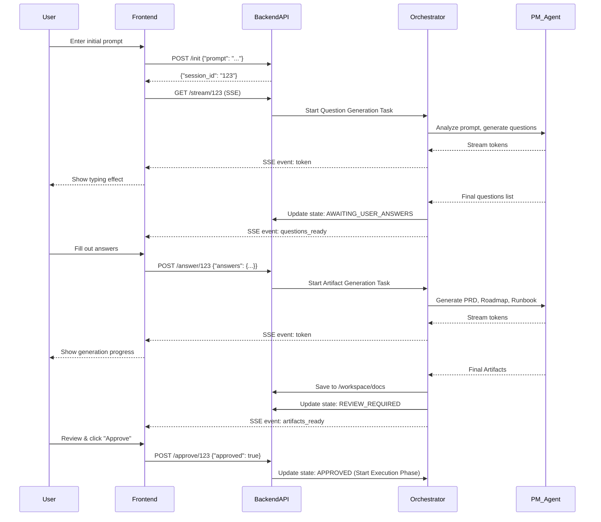

# Discovery Engine API & Logic Architecture

This document outlines the API schema, data models, state machine, and flow for the AgencyOS Discovery Engine, utilizing a REST + Server-Sent Events (SSE) architecture.

## 1. Data Models

```python
from pydantic import BaseModel
from typing import List, Dict, Optional
from enum import Enum

class DiscoveryState(str, Enum):
    INITIATED = "initiated"
    GENERATING_QUESTIONS = "generating_questions"
    AWAITING_USER_ANSWERS = "awaiting_user_answers"
    GENERATING_ARTIFACTS = "generating_artifacts"
    REVIEW_REQUIRED = "review_required"
    APPROVED = "approved"

class InitialPrompt(BaseModel):
    prompt: str

class UserAnswers(BaseModel):
    answers: Dict[str, str]  # Keyed by question ID or index

class Artifacts(BaseModel):
    prd: str
    roadmap: str
    runbook: str

class DiscoverySession(BaseModel):
    session_id: str
    state: DiscoveryState
    initial_prompt: str
    questions: List[str] = []
    answers: Dict[str, str] = {}
    artifacts: Optional[Artifacts] = None
```

## 2. API Endpoints

### `POST /api/v1/discovery/init`
Starts a new discovery session.
- **Request Body:** `{"prompt": "Build a CRM for real estate agents"}`
- **Response:** `{"session_id": "uuid-1234", "state": "initiated"}`
- **Action:** Backend creates a session in memory/DB, sets state to `GENERATING_QUESTIONS`, and triggers the Orchestrator thread.

### `GET /api/v1/discovery/{session_id}/stream`
SSE endpoint for real-time updates.
- **Response:** stream of events
  ```text
  event: status
  data: {"state": "generating_questions"}

  event: token
  data: {"content": "What "}

  event: token
  data: {"content": "is "}
  
  event: questions_ready
  data: {"questions": ["What is your budget?", "Any timeline?"]}
  ```

### `POST /api/v1/discovery/{session_id}/answer`
Submits user answers to the clarifying questions.
- **Request Body:** `{"answers": {"0": "Under $5k", "1": "3 weeks"}}`
- **Response:** `{"status": "success", "state": "generating_artifacts"}`
- **Action:** Backend updates session, sets state to `GENERATING_ARTIFACTS`, and triggers Orchestrator to generate PRD, Roadmap, Runbook.

### `GET /api/v1/discovery/{session_id}/artifacts`
Retrieves the finalized artifacts (also sent via SSE).
- **Response:** `{"state": "review_required", "artifacts": {"prd": "...", "roadmap": "...", "runbook": "..."}}`

### `POST /api/v1/discovery/{session_id}/approve`
User approves the generated artifacts to move to Phase 1 (Execution).
- **Request Body:** `{"approved": true}`
- **Response:** `{"status": "success", "state": "approved"}`

## 3. Python Logic / Orchestrator State Machine

The Python backend will manage the state machine. When `POST /init` or `POST /answer` is hit, it fires off an asynchronous background task (`asyncio.create_task` or a Celery/Redis queue worker) to interact with the LLM.

**State Flow:**
1. `INITIATED`: Setup session variables. Transition to `GENERATING_QUESTIONS`.
2. `GENERATING_QUESTIONS`: Invoke Project Manager agent to analyze initial prompt. Stream response tokens via SSE. Once complete, save questions to session. Transition to `AWAITING_USER_ANSWERS`.
3. `AWAITING_USER_ANSWERS`: Idle. Waiting for user `POST /answer`.
4. `GENERATING_ARTIFACTS`: Upon receiving answers, invoke Project Manager and Strategist agents to generate PRD, Roadmap, Runbook based on context. Stream tokens via SSE. Save artifacts to file system (`/docs/...`) and session object. Transition to `REVIEW_REQUIRED`.
5. `REVIEW_REQUIRED`: Idle. Awaiting user `POST /approve`.
6. `APPROVED`: Trigger the Dev/QA execution pipeline.

## 4. Sequence Diagram


