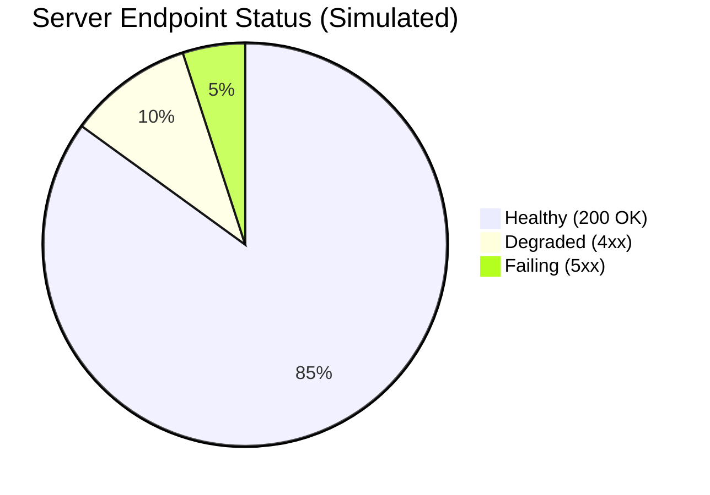
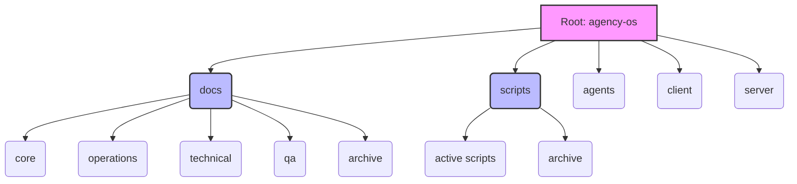
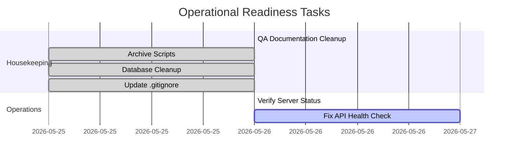

# Workspace Health & Operations Executive Summary

## 1. Overview
Following the recent system housekeeping, this executive summary provides an overview of the current workspace structure, operational readiness, and server health. 

### Recent Housekeeping Changes
- **QA Documentation Cleanup:** The `docs/qa/` folder was successfully restructured, duplicate files were archived, and a new unified `QA_INDEX.md` was created and signed off by the Evidence Collector to streamline testing documentation.
- **Archive Scripts:** Development and temporary scripts were correctly moved to `scripts/archive/` (e.g., `fix_a11y.py`, `patch.js`).
- **Database Cleanup:** Removed temporary and stale test databases.
- **Git Hygiene:** Updated `.gitignore` to maintain a clean repository.

## 2. Server Status and API Health

- **Server:** Uvicorn running on port `8001`
- **Health Endpoint (`/api/v1/health`):** Currently returning `404 Not Found`.

## 3. Workspace Structure

The workspace has been organized into clear, functional domains:

## 4. Operational Readiness

The environment is in a well-structured state, though the API health check endpoint issue (`404`) needs to be resolved by the backend team.

