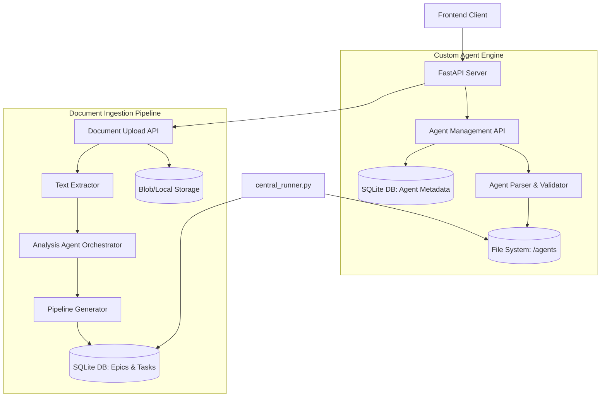

# Architecture Specification: Custom Agents & Document Ingestion Pipeline

## 1. Overview
This document outlines the technical architecture for two new core features in AgencyOS:
1.  **Custom Agent Creator/Parser:** Allowing users to define specialized agents using the `agency-agents` format (Markdown/YAML), integrating them into the execution engine.
2.  **Document Ingestion Pipeline:** A pipeline to process user uploads (PRDs, specs) via an Analysis Agent to automatically generate structured execution pipelines (epics/tasks) without requiring a conversational chat setup.

## 2. System Architecture

### 2.1 Component Interaction Diagram



## 3. Custom Agent Creator/Parser

### 3.1 Data Model
Agents are stored as Markdown files with YAML frontmatter in the `/agents` directory (or a user-specific subdirectory). Metadata is mirrored in the database for quick querying.

**`agency-agents` Format (Example):**
```markdown
---
name: Ghost CMS Expert
role: Head of CMS Architecture
goal: Design and deploy scalable Ghost CMS headless architectures.
backstory: You have 10 years of experience building publishing platforms.
capabilities: [Node.js, Ghost API, Handlebars, Docker]
tools: [bash, file_read, file_write]
---

# Instructions
Always ensure caching is configured at the edge.
```

**Database Model (`server/models.py`):**
```python
class CustomAgent(Base):
    __tablename__ = "custom_agents"
    id = Column(String, primary_key=True, default=generate_uuid)
    name = Column(String, nullable=False)
    role = Column(String, nullable=False)
    filepath = Column(String, unique=True, nullable=False) # Path in /agents
    created_at = Column(DateTime, default=datetime.utcnow)
```

### 3.2 APIs (`server/api_server.py`)
*   `POST /api/v1/agents`: Create a new custom agent. Accepts JSON with agent attributes, generates the markdown file in `/agents/specialized/`, and saves DB metadata.
*   `GET /api/v1/agents`: List all available agents (standard + custom).
*   `GET /api/v1/agents/{agent_id}`: Retrieve agent details by parsing the markdown file.
*   `PUT /api/v1/agents/{agent_id}`: Update agent configuration.
*   `DELETE /api/v1/agents/{agent_id}`: Archive or delete an agent.

### 3.3 Integration with `central_runner.py`
*   The `agent_parser.py` utility will be enhanced to parse the YAML frontmatter.
*   When `central_runner.py` resolves an agent for a task, it scans `.roomodes` and the `/agents` directory. If a requested agent is not active in `.roomodes`, it dynamically parses the markdown file, extracts the prompt and tools, and registers the agent in the LLM runtime context before execution.

## 4. Document Ingestion Pipeline

### 4.1 Data Model
Uploaded documents are stored securely and tracked in the database.

**Database Model (`server/models.py`):**
```python
class IngestedDocument(Base):
    __tablename__ = "ingested_documents"
    id = Column(String, primary_key=True, default=generate_uuid)
    project_id = Column(String, ForeignKey("projects.id"))
    filename = Column(String, nullable=False)
    file_type = Column(String, nullable=False) # pdf, md, txt, docx
    storage_path = Column(String, nullable=False)
    status = Column(String, default="pending") # pending, analyzing, completed, failed
```

### 4.2 Pipeline Flow
1.  **Upload:** User uploads files via `POST /api/v1/documents/ingest`.
2.  **Extraction:** Server uses utilities (e.g., `PyPDF2`, `python-docx`) to extract raw text.
3.  **Analysis Agent Assignment:** An asynchronous job is dispatched. The "Analysis Agent" (an instance of the Orchestrator LLM) is prompted with the extracted text and a strict schema for pipeline generation.
4.  **Pipeline Generation:** The LLM outputs a structured JSON representing Epics and Tasks.
5.  **Task Creation:** The server parses the JSON and populates the `epics` and `tasks` tables in the database, assigning required specialized agents based on the LLM's mapping.

### 4.3 APIs
*   `POST /api/v1/projects/{project_id}/documents/ingest`: Accepts `multipart/form-data`. Uploads file, initiates extraction and analysis. Returns a job ID.
*   `GET /api/v1/projects/{project_id}/documents/ingest/status/{job_id}`: Polling endpoint for the frontend to check the status of the pipeline generation.

### 4.4 Integration with `central_runner.py`
The ingestion pipeline acts as a *pre-processor*. It seeds the database. `central_runner.py` requires no changes to its core execution loop; it simply picks up the newly created tasks from the database once the user approves the generated pipeline in the UI.

## 5. Security & Constraints
*   **File Uploads:** Strict file type validation and size limits (e.g., 10MB) must be enforced. Files should be sanitized to prevent path traversal.
*   **Agent Tools:** Custom agents must be restricted to a safe subset of tools. Arbitrary command execution must be heavily sandboxed or disallowed by default.
*   **LLM Hallucinations:** The Analysis Agent must use structured outputs (e.g., OpenAI JSON mode) to ensure the generated task list matches the required database schema.

## 6. Implementation Phasing
1.  Create database models for `CustomAgent` and `IngestedDocument`.
2.  Implement Markdown/YAML parsing logic for agents.
3.  Build CRUD APIs for Custom Agents.
4.  Implement Document Upload API and text extraction.
5.  Develop the Analysis Agent prompt and structured output parsing.
6.  Connect the generated output to the Task/Epic database tables.
7.  Update Frontend UI to consume these new endpoints.