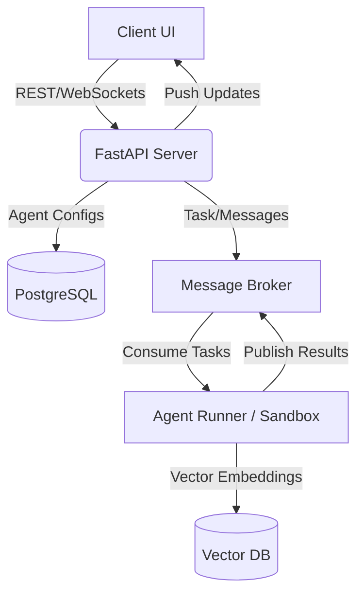

# System Architecture

## 1. Executive Summary
AgencyOS is an enterprise-grade multi-agent orchestration platform designed to run autonomous AI agents in secure, isolated sandboxes. The architecture strictly separates the orchestration layer from the execution layer, ensuring scalable, resilient, and secure agent interactions via Directed Acyclic Graphs (DAGs) and dynamic team pods.

## 2. System Components

* **Frontend Client (Vite/React/Tailwind):** A single-page application providing the unified workspace interface, real-time agent memory inspection, pod chat containers, and RBAC management.
* **API Server (FastAPI/Python):** The central orchestration layer handling user authentication, agent configurations, pipeline execution (DAGs), and real-time WebSocket communication.
* **NEXUS Pipeline (Central Orchestration Engine):** The absolute core routing and execution backbone of AgencyOS. NEXUS manages the lifecycle of multi-agent DAGs, resolving dependencies, allocating tasks to specialized agents (e.g., from the `/agents` directory), and integrating Model Context Protocol (MCP) skills seamlessly into the execution flow.
* **Agent Sandbox / Execution Engine:** Isolated Docker/containerized environments where LLM-powered agents execute arbitrary code safely. Features a hardware kill switch and resource limitations.
* **Message Broker (Redis/RabbitMQ):** Facilitates asynchronous communication between the API server and agent runners. Enables event-driven updates to the client (e.g., streaming logs).
* **Semantic Search & RAG Service:** Integrates with a vector database (e.g., Pinecone/Milvus) for agent memory retrieval, document parsing, and contextual context injection.
* **Relational Database (PostgreSQL):** Stores persistent state, including users, workspaces, agent templates, DAG definitions, and audit logs.

## 3. Data Flow

## 4. Infrastructure & Hosting
* **Deployment:** Containerized via Docker Compose for local/dev, Kubernetes for production environments.
* **Scaling:** Stateless API servers horizontally auto-scale based on CPU/RAM metrics. Agent Sandbox environments scale dynamically based on queue depth.
* **Networking:** Internal VPC for microservices communication, public traffic routed through a Reverse Proxy/API Gateway (e.g., NGINX/Traefik).

## 5. Security Architecture
* **Agent Isolation:** Agents execute in hardened, ephemeral Docker containers without root access, communicating only via designated message queues.
* **Authentication:** JWT-based stateless authentication with strict Role-Based Access Control (RBAC) separating Workspace Owners, Members, and Viewers.
* **Data Poisoning Prevention:** Inputs undergo strict sanitization and validation through the `validation_layer.py`.
* **Hardware Kill Switch:** A `kill_switch.py` service actively monitors rogue processes and excessive token usage, terminating sandboxes instantly when limits are exceeded.